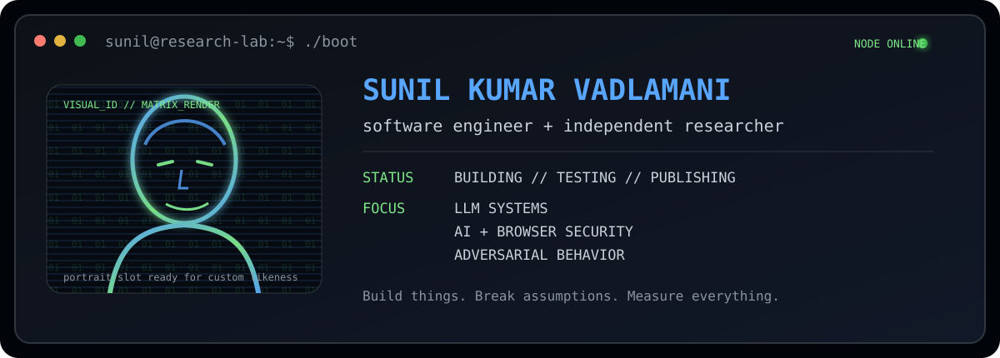

<p align="center">
  
</p>

<p align="center">
  <a href="https://github.com/sunilteja93/llmrig"><b>LLMRig</b></a>
  &nbsp;&nbsp;•&nbsp;&nbsp;
  <a href="https://github.com/BSM-Labs/browser-security-monitoring"><b>Browser Security Monitoring</b></a>
  &nbsp;&nbsp;•&nbsp;&nbsp;
  <a href="https://doi.org/10.1109/ACCESS.2026.3712744"><b>IEEE Access</b></a>
  &nbsp;&nbsp;•&nbsp;&nbsp;
  <a href="https://orcid.org/0009-0002-2993-7748"><b>ORCID</b></a>
</p>

```text
sunil@research-lab:~$ whoami

software engineer + independent researcher
working where LLMs, security, systems, and real-world constraints collide.
```

## `$ cat ./research_focus`

```text
LLM SYSTEMS        ██████████  local inference · evaluation · tooling
AI SECURITY        ██████████  prompt injection · adversarial behavior
BROWSER SECURITY   ████████░░  JavaScript API abuse · runtime monitoring
SECURE SYSTEMS     ████████░░  assumptions · failure modes · real-world edges
```

## `$ ls -la ~/featured`

<table>
<tr>
<td width="50%" valign="top">

### [`LLMRig`](https://github.com/sunilteja93/llmrig)

Cross-platform local LLM setup and benchmarking.

It inspects the hardware you actually have, recommends a practical local model setup, helps configure it through Ollama, and benchmarks the result on your machine.

```text
mode: build
focus: local-ai / inference / benchmarking
```

</td>
<td width="50%" valign="top">

### [`Browser Security Monitoring`](https://github.com/BSM-Labs/browser-security-monitoring)

Browser-resident detection for JavaScript API abuse and prompt injection attacks.

The repository accompanies the 2026 IEEE Access paper and includes the browser extension and evaluation code used in the research.

```text
mode: research
focus: browser-security / ai-security
```

</td>
</tr>
</table>

## `$ git log --research --oneline`

**2026** · **BSM: A Browser-Resident Framework for Real-Time Detection of JavaScript API Abuse and Prompt Injection Attacks**  
IEEE Access · [Paper](https://doi.org/10.1109/ACCESS.2026.3712744) · [Source](https://github.com/BSM-Labs/browser-security-monitoring)

## `$ tail -f ./current.log`

```text
[BUILD]  local LLM evaluation and testing workflows
[TEST]   adversarial inputs and prompt-injection defenses
[TRACE]  agentic systems and model behavior
[SHIP]   reproducible research + open-source tooling
```

## `$ git activity`

<p align="center">
  
  
</p>

<p align="center">
  
</p>

## `$ ./connect`

<p align="center">
  <a href="https://orcid.org/0009-0002-2993-7748">ORCID</a>
  &nbsp;•&nbsp;
  <a href="https://doi.org/10.1109/ACCESS.2026.3712744">IEEE Access</a>
  &nbsp;•&nbsp;
  <a href="https://github.com/BSM-Labs/browser-security-monitoring">BSM Labs</a>
  &nbsp;•&nbsp;
  <a href="https://github.com/sunilteja93/llmrig">LLMRig</a>
</p>

```text
sunil@research-lab:~$ ./motd
Build things. Break assumptions. Measure everything.
```
