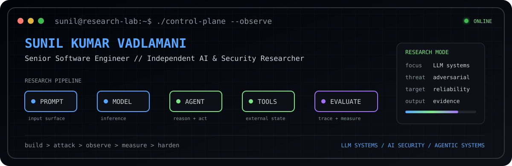
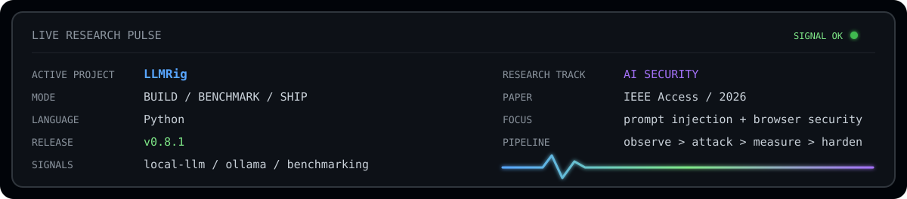

<p align="center">
  
</p>

<p align="center">
  <a href="https://github.com/sunilteja93/llmrig"><b>LLMRig</b></a>
  &nbsp;&nbsp;•&nbsp;&nbsp;
  <a href="https://github.com/BSM-Labs/browser-security-monitoring"><b>Browser Security Monitoring</b></a>
  &nbsp;&nbsp;•&nbsp;&nbsp;
  <a href="https://doi.org/10.1109/ACCESS.2026.3712744"><b>IEEE Access</b></a>
  &nbsp;&nbsp;•&nbsp;&nbsp;
  <a href="https://orcid.org/0009-0002-2993-7748"><b>ORCID</b></a>
</p>

## `$ ./pulse --live`

<p align="center">
  
</p>

```text
sunil@research-lab:~$ whoami

Senior Software Engineer
Independent AI & Security Researcher

I build and study systems where models, tools, browsers,
and real-world constraints collide.
```

## `$ ./research --map`

```text
LLM SYSTEMS       inference · evaluation · local models · harnesses
AI SECURITY       prompt injection · adversarial behavior · defenses
AGENTIC SYSTEMS   tools · traces · reliability · failure modes
SECURE SYSTEMS    runtime monitoring · browser security · real-world edges
```

## `$ ls ~/featured`

<table>
<tr>
<td width="50%" valign="top">

### [`LLMRig`](https://github.com/sunilteja93/llmrig)

A cross-platform tool for practical local LLM setup and benchmarking.

It inspects the hardware you actually have, recommends a model configuration, helps set it up through Ollama, and benchmarks the result on your machine.

```text
signal: local-ai / inference / benchmarking
```

</td>
<td width="50%" valign="top">

### [`Browser Security Monitoring`](https://github.com/BSM-Labs/browser-security-monitoring)

A browser-resident framework for detecting JavaScript API abuse and prompt injection attacks in real time.

The repository accompanies my 2026 IEEE Access paper and contains the browser extension and evaluation code used in the research.

```text
signal: browser-security / ai-security
```

</td>
</tr>
</table>

## `$ git log --research --oneline`

**2026** · **BSM: A Browser-Resident Framework for Real-Time Detection of JavaScript API Abuse and Prompt Injection Attacks**  
IEEE Access · [Paper](https://doi.org/10.1109/ACCESS.2026.3712744) · [Source](https://github.com/BSM-Labs/browser-security-monitoring)

## `$ tail -f ./lab.log`

```text
[BUILD]  LLM evaluation + testing infrastructure
[ATTACK] adversarial inputs + prompt-injection defenses
[TRACE]  agent/tool behavior + reliability failures
[SHIP]   reproducible research + open-source systems
```

## `$ cat ./operating_principles`

```text
observe the system
attack the assumptions
measure the failure
harden what matters
```

<p align="center">
  <sub>LLM systems · AI security · agentic systems · secure software</sub>
</p>
